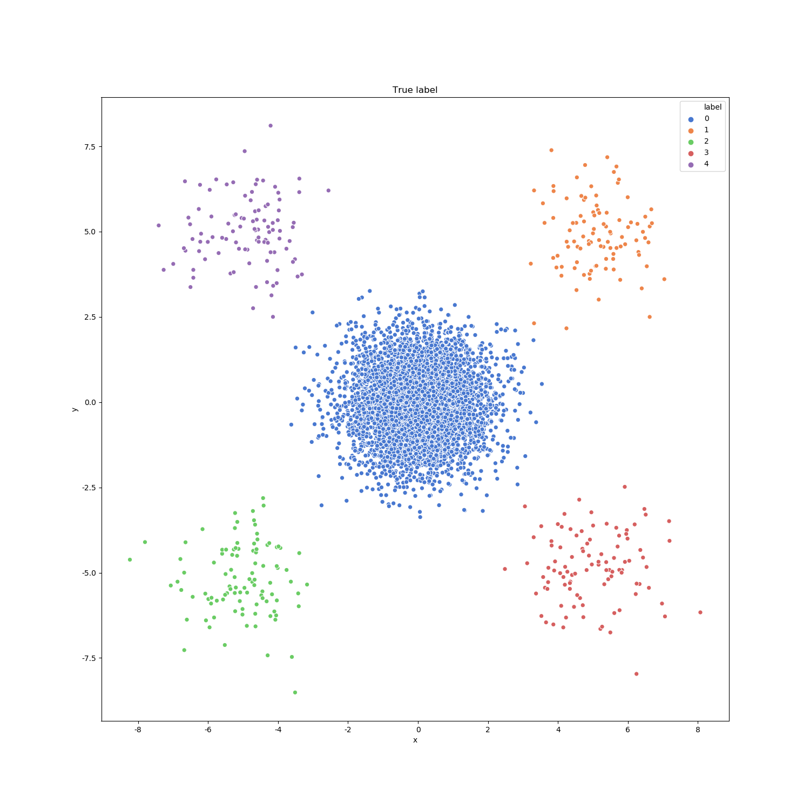
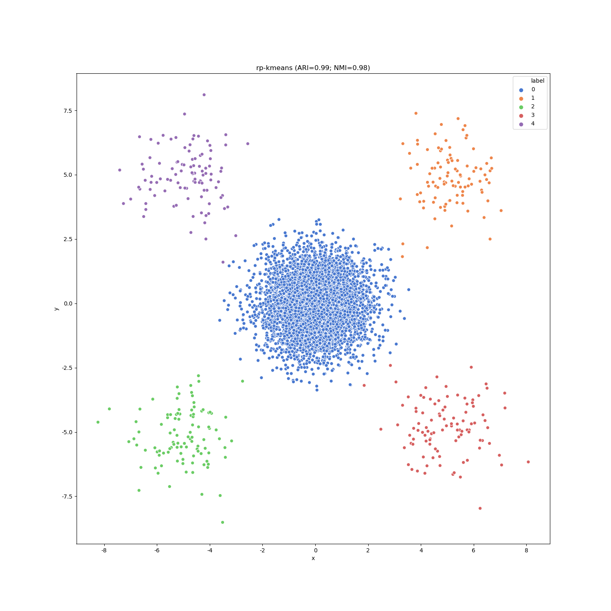
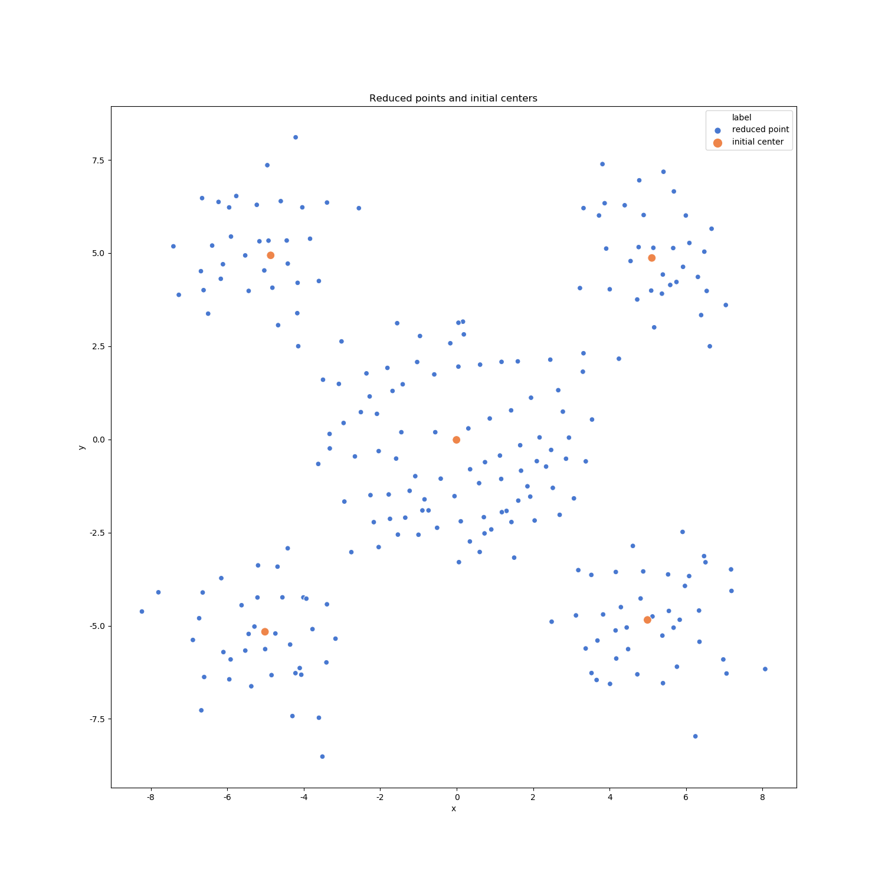

# RPH-KMeans 

**RPH-KMeans** is a variant of kmeans algorithm in which the initial centers is produced by point reduction process using one of the **local sensitive hashing (LSH)** technique called **random projection (RP)**.


# Installation
To install RPH-Kmeans, simply run the setup script:

```
python3 setup.py install
```

Or use `pip`:

```
pip3 install rph_kmeans
```

Or install from git repo directly: 

```
pip3 install git+https://github.com/tinglabs/rph_kmeans.git
```

To run basic clustering:

```python
# Note: 
# type(X) = np.ndarray or scipy.sparse.csr_matrix;
# X.shape = (n_samples, n_features)

from rph_kmeans import RPHKMeans
clt = RPHKMeans()
labels = clt.fit_predict(X)
```

To estimate the number of clusters:

```python
# Note:
# type(X) = np.ndarray or scipy.sparse.csr_matrix;
# X.shape = (n_samples, n_features)
# type(kmax) = int; 
# Let k_ be the possible cluster number, it's recommended to set kmax = k_ * 3

from rph_kmeans import select_k_with_bic
optimal_k, _, _ = select_k_with_bic(X, kmax=kmax)
```

## Note
For **Mac OSX**, it maybe help to run the command first before running `setup.py`:

```
export MACOSX_DEPLOYMENT_TARGET=10.9
```
which can fix 

- `ld: library not found for -lstdc++` 
- `C++ STL headers not found`

If the installation fails when compiling c++ extension, you can just add the path of `rph_kmeans` to `PYTHONPATH` and use **python** version (`point_reducer_version = "py"`) instead of **cython** version (`point_reducer_version = "cy"`).


# Demo
The experiments show that **RPH-KMeans** can deal with imblanced data much better than **KMeans (k-means++ initialization)** and **KMeans (random initialization)** .

## Simulation
Run the script `examples/simulate.py`:

```
python3 simulate.py
```

### Simlated Data
2-d simulated data is generated:

- clusters number: 5
- gaussian distribution
	- label `0`: `mean=(0, 0); cov=1.0`
	- label `1`: `mean=(5, 5); cov=1.0`
	- label `2`: `mean=(-5, -5); cov=1.0`
	- label `3`: `mean=(5, -5); cov=1.0`
	- label `4`: `mean=(-5, 5); cov=1.0`
- samples number: 
	- label `0`: 5000
	- label `1`: 100
	- label `2`: 100
	- label `3`: 100
	- label `4`: 100

It looks like:
 

### Performance of RPH-KMeans
Run rph-kmeans with default config, we get

- **ARI**: 0.99
- **NMI**: 0.98

The final cluster centers:
 

The predicted label:
 

The reduced points generated by random projection and the initial centers:

 

### Performance of KMeans (kmeans++)
Run Kmeans (init='kmeans++'; n_init=10), we get

- **ARI**: 0.13
- **NMI**: 0.37

The final cluster centers:
_cluster_centers.png) 

The predicted label:
_y_pred.png) 

Use KMeans (kmeans++; n_init=10) to cluster:

### Performance of KMeans (random)
Run Kmeans (init='random'; n_init=10), we get

- **ARI**: 0.23
- **NMI**: 0.51

The final cluster centers:
_cluster_centers.png) 

The predicted label:
_y_pred.png) 

### Summary

A more detailed result is as follow (Metric mean and standard deviation of 10  repeat). The running log are in `examples/performance_test/log.txt`.

| Method | Real Time (s) | CPU Time (s) | ARI | NMI |
| ---- | ---- | ---- | ---- | ---- | 
| RPH-KMeans (n_init=1)) | 0.208 (0.105) | 0.206 (0.105) | 0.997 (0.000) | 0.992 (0.000) |
| KMeans (kmeans++; n_init=1) | 0.074 (0.042) | 0.074 (0.042) | 0.175 (0.062) | 0.441 (0.079) |
| KMeans (kmeans++; n_init=5) | 0.325 (0.168) | 0.325 (0.168) | 0.316 (0.227) | 0.570 (0.141) |
| KMeans (kmeans++; n_init=10) | 0.636 (0.318) | 0.636 (0.318) | 0.693 (0.373) | 0.805 (0.230) |
| KMeans (random; n_init=1) | 0.089 (0.052) | 0.089 (0.052) | 0.202 (0.039) | 0.470 (0.067) |
| KMeans (random; n_init=5) | 0.390 (0.207) | 0.390 (0.207) | 0.200 (0.055) | 0.463 (0.073) |
| KMeans (random; n_init=10) | 0.800 (0.399) | 0.800 (0.399) | 0.215 (0.047) | 0.491 (0.063) |

### Estimation of cluster number
The cluster number can be correctly estimated by finding the knee point of  **BIC** curve: 


